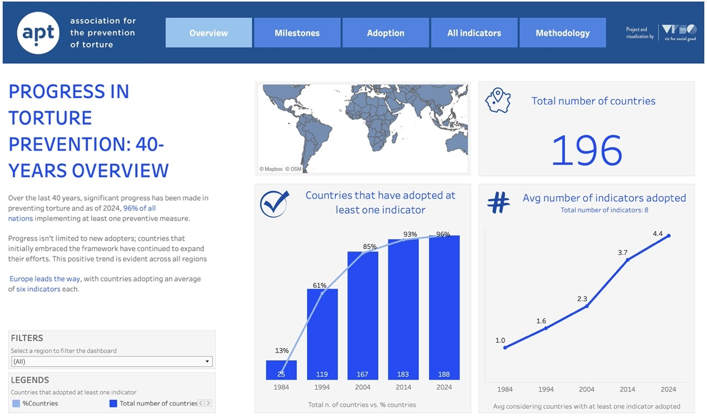

<h1 style="font-weight:normal">
  Viz for social good
</h1>

Projects for the [Viz for social good association](https://www.vizforsocialgood.com)

## :clipboard: About 

I’ve always enjoyed participating in volunteer activities—they foster a deeper sense of belonging to our community. 
However, over the years, my busy schedule gradually took over, and I couldn't find time for it anymore. 
During my career break, I came across an incredible organization that brings together data visualization experts 
from around the world to collaborate with various organizations. Together, they create impactful and compelling 
visualizations to support their missions.
This was the first time I had the chance to use my data skills to give back to the community, and I absolutely 
loved the experience.

## :file_folder: Projects:
1) 40 Years of Torture Prevention: A Comprehensive Overview | APT (Association for the Prevention of Torture)
    - Project repository link *[here](https://github.com/gcmourao/VizForGood/tree/main/APT)*
    - Project dashboard link *[here](https://public.tableau.com/views/40YearsofTorturePreventionAComprehensiveOverview/Overview)*

  
   

